# Usage

The following section shows how to use arcos-gui.

## Open Main Widget, Load Data, and run ARCOS

#### Open Widget
1. Make sure the plugin is installed and is the most recent stable version
2. Open the arcos-gui plugin from the napari toolbar:

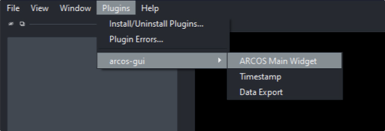{ width="500" }

#### Load Data
3. Load and filter the data:

    a. Open file browser and select comma-delimited CSV file in long format.

    b. Load CSV file.

    c. In the popup dialogue, select columns corresponding to the indicated label. For Z-coordinates and Position can be None if this column does not exist.

    d. Filter input data. Parameters can be used to select track length, rescale frame interval and rescale measurement.

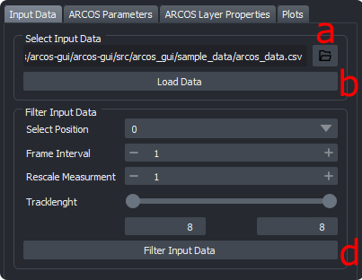{ width="300" } 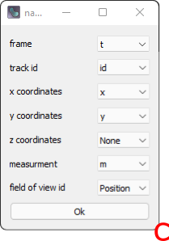{ width="150" }

#### Run ARCOS
4. Select ARCOS parameters and run the algorithm

    a. Select ARCOS parameters see [ARCOS parameters for in detail explanation](#arcos-parameters)

    b. Update ARCOS. Will run the algorithm and generate layers.

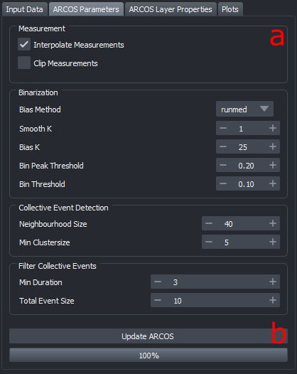{ width="400" }

## Generated Layers

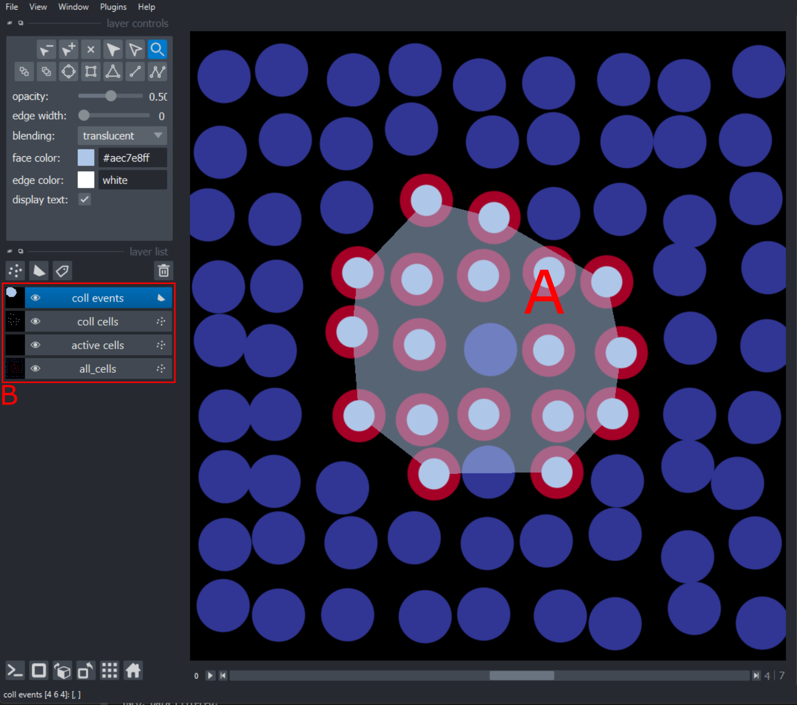{ width="600" }

- a. Detected collective event with its convex hull.

- b. Generated layers are:

    1. all_cells: centroid of cells with the color code representing the measurement.
    2. active cells: points represent active cells according to binarization
    3. coll cells: cross marking cells that are part of a collective event
    4. coll event: the convex hull of collective events

## Other Widgets

### Exporting Data
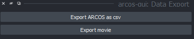{ width="400" }

#### Export CSV file
The data generated by Arcos can be exported as a CSV file using the Export data widget.
Can be loaded just as the main widget.

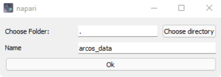{ width="400" }

#### Export Image sequence
Images of the viewer can be exported using the Export Movie button.
The option automatically determines the correct viewer size and will try to automatically fit the data into the viewer.

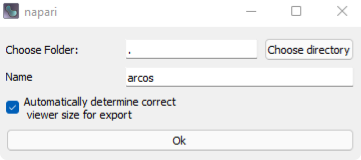{ width="400" }

### Timestamp
Timestamps can be added with the Timestamp widget. Can be loaded just as the main widget.

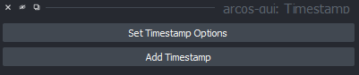{ width="400" }

#### Timestamp options
Options can be set using the Timestamp Options dialogue

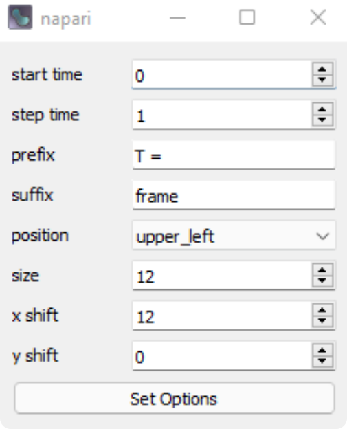{ width="200" }

## ARCOS parameters

### Measurement
| Parameters               | Description                                                                                                        |
|--------------------------|--------------------------------------------------------------------------------------------------------------------|
| Interpolate Measurements | If the tickbox is checked, missing values are  interpolated across all columns in the input data                       |
| Clip Measurements        | if the tickbox is checked, the measurement will be clipped according to the quantiles provided in clip low and clip high |
| Clip Low                 | appears if clip measurements is checked                                                                            |
| Clip High                | appears if clip measurements is checked                                                                            |

### Binarization

| Parameter                 | Description                                                                                         |
|---------------------------|-----------------------------------------------------------------------------------------------------|
| Bias Method               | Choose de-trending method,  can be runmed, lm or none                                     |
| Smooth K                  | Size of the short-term median smoothing filter.                                                         |
| Bias K                    | Available if Bias Method is set to 'runmed',  size of long term median smoothing filter          |
| polyDeg                   | Available if Bias Method is set to 'lm', sets the degree of the polynomial for regression detrending |
| Bin Peak Threshold        | Threshold for rescaling of the de-trended signal.                                                   |

First, a short-term median filter with size smoothK is applied to remove fast noise from the time series. If the de-trending method is set to "none", smoothing is applied on globally rescaled time series. The subsequent de-trending can be performed with a long-term median filter with the size biasK {biasMet = "runmed"} or by fitting a polynomial of degree polyDeg {biasMet = "lm"}.
After de-trending, if the global difference between min/max is greater than the threshold the signal is rescaled to the (0,1) range. The final signal is binarised using the binThr threshold parameter.

### Collective Event Detection

| Parameter          | Description                                                                                                                                                                                                                                                     |
|--------------------|-----------------------------------------------------------------------------------------------------------------------------------------------------------------------------------------------------------------------------------------------------------------|
| Neighbourhood Size | The maximum distance between two samples for one to be considered as in the neighbourhood of the other. This is not a maximum bound  on the distances of points within a cluster.  Value is also used to connect collective events across multiple frames. |
| Min Clustersize    | Minimum size for a cluster to be identified as a collective event.                                                                                                                                                                                              |

### Filter Collective Events

| Parameter        | Description                                           |
|------------------|-------------------------------------------------------|
| Min Duration     | Minimal duration of collective events to be selected. |
| Total Event Size | Minimal total event size.                             |

## Plots
Under the main widgets plotting tab, several types of plots can be found that describe the time-series data and collective events.

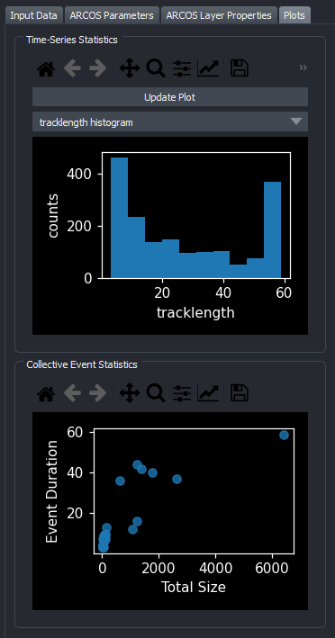{ width="400" }

### Time-series statistics
These plots help to choose appropriate parameters for Arcos and track length filtering.
Available plots are:

- Track length Histogram
- Measurement Density plot (kde)
- X-T and Y-T plot

### Collective Event statistics
This plot shows collective event duration over collective event size.
