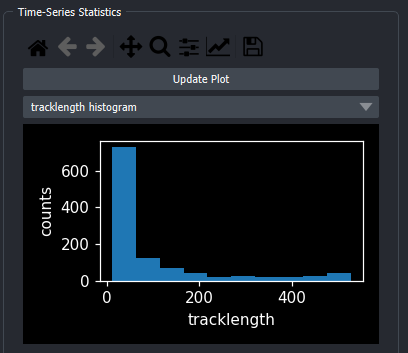
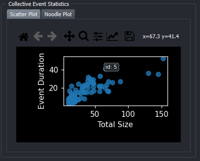
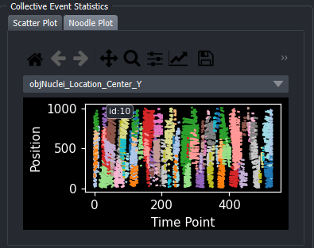

# Usage

The following section shows how to use arcos-gui.

## Open Main Widget, Load Data, and run ARCOS

#### Open Widget
1. Make sure the arcos-gui and napari are installed.
2. Open napari and dock the ARCOS main widget:

{ width="500" }

#### Load Data
3. Load and filter the data:

    a. Open file browser and select CSV file with data in long format. CSV file can be either comma, semicolon or tab separated. Additionally arcos-gui supports loading csv.gz files.

    b. Load CSV file.

    c. In the popup dialogue, select columns corresponding to the indicated label. For Z-coordinates, Position and Additional Filter (e.g Well) can be None if this column does not exist.
    Optionally mathematical operations can be performed either between columns (i.e for Ratios of fluorescent biosensors). Depending on the selection of the operation via radio buttons,
    an additional column can be specified as second measurement. Default is None.

    d. Filter input data. Parameters can be used to select track length, rescale frame interval and rescale measurement.

{ width="300" } { width="400" }

#### Run ARCOS
4. Select ARCOS parameters and run the algorithm.

    a. Change ARCOS parameters, see the [ARCOS parameters](#arcos-parameters) section for in detail explanation.

    b. Update ARCOS. Will run the algorithm and generate layers.

{ width="400" }

## Generated Layers

{ width="600" }

- a. Detected collective event with its convex hull.

- b. Generated layers are:

    1. all_cells: centroid of cells with the color code representing the measurement.
    2. active cells: points represent active cells according to binarization
    3. coll cells: Points marking cells that are part of a collective event, colored by collective event id.
    4. coll event: the convex hull of collective events, colored by collective event id.

## Other Widgets

### Exporting Data
{ width="400" }

#### Export CSV file
The data generated by Arcos can be exported as a CSV file using the Export data widget.
Can be docked in the same way as the main widget.

{ width="400" }

#### Export Image sequence
Images of the viewer can be exported using the Export Movie button.
The option automatically determines the correct viewer size and will try to automatically fit the data into the viewer.

{ width="400" }

### Timestamp
Timestamps can be added with the Timestamp widget. Can be loaded just as the main widget.

{ width="400" }

#### Timestamp options
Options can be set using the Timestamp Options dialogue

{ width="200" }

## ARCOS parameters

### Measurement
| Parameters               | Description                                                                                                        |
|--------------------------|--------------------------------------------------------------------------------------------------------------------|
| Interpolate Measurements | If the tickbox is checked, missing values are  interpolated across all columns in the input data                       |
| Clip Measurements        | if the tickbox is checked, the measurement will be clipped according to the quantiles provided in clip low and clip high |
| Clip Low                 | appears if clip measurements is checked                                                                            |
| Clip High                | appears if clip measurements is checked                                                                            |

### Binarization

| Parameter                 | Description                                                                                         |
|---------------------------|-----------------------------------------------------------------------------------------------------|
| Bias Method               | Choose de-trending method,  can be runmed, lm or none                                     |
| Smooth K                  | Size of the short-term median smoothing filter.                                                         |
| Bias K                    | Available if Bias Method is set to 'runmed',  size of long term median smoothing filter          |
| polyDeg                   | Available if Bias Method is set to 'lm', sets the degree of the polynomial for regression detrending |
| Bin Peak Threshold        | Threshold for rescaling of the de-trended signal.                                                   |

First, a short-term median filter with size smoothK is applied to remove fast noise from the time series. If the Bias Method is set to "none", smoothing is applied on globally rescaled time series. The subsequent de-trending can be performed with a long-term median filter with the size biasK {biasMet = "runmed"} or by fitting a polynomial of degree polyDeg {biasMet = "lm"}.
After de-trending, if the global difference between min/max is greater than the threshold the signal is rescaled to the (0,1) range. The final signal is binarised using the binThr threshold parameter.

### Collective Event Detection

| Parameter          | Description                                                                                                                                                                                                                                                     |
|--------------------|-----------------------------------------------------------------------------------------------------------------------------------------------------------------------------------------------------------------------------------------------------------------|
| Neighbourhood Size | The maximum distance between two samples for one to be considered as in the neighbourhood of the other. This is not a maximum bound  on the distances of points within a cluster.  Value is also used to connect collective events across multiple frames. |
| Min Clustersize    | Minimum size for a cluster to be identified as a collective |
| nPrev frames       | Number of previous frames to consider when tracking collective_events |

### Filter Collective Events

| Parameter        | Description                                           |
|------------------|-------------------------------------------------------|
| Min Duration     | Minimal duration of collective events to be selected. |
| Total Event Size | Minimal total event size.                             |

### Additional
Add Convex Hull: If checked, the convex hull is calculated for each collective event and drawn in 2d as polygons, in 3d as surfaces. If a large ammount of collective events are detected, adding
polygons / surfaces can take some time.

## Plots
Under the main widgets plotting tab, several types of plots can be found that describe the time-series data and collective events.
Plots can be saved as images, zoomed in to display only certain areas via the plot toolbar on top of each plot.

### Input data statistics
These plots help to choose appropriate parameters for Arcos and track length filtering.
Plots are chosen through dropdown menus.
Available plots are:

- Track length Histogram
- Measurement Density plot (kde)
- X-T and Y-T plot

{ width="400" }

### Scatterplot
Interactive Scatterplot of duration vs size.
On hover, shows collective event id, on click takes user to first frame of selected collective event and marks this event with a bounding box.

{ width="400" }

### Noodleplot
Interactive Noodleplot of object id vs time. Object tracks are colored by collective event id.
On hover, shows collective event id, on click takes user to first frame of selected collective event and marks this event with a bounding box.
Dropdown allows choice of projection axis.

{ width="400" }
