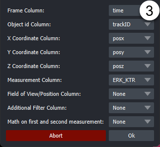

# Usage

The following section shows how to use arcos-gui.

## Open Main Widget, Load Data, and run ARCOS

#### Open Widget
Make sure the arcos-gui and napari are installed.

0. Open napari and dock the ARCOS main widget:

#### Load Data

1. Tabs represent different steps taken during the processing. Select the "Input Data" Tab to load a CSV file.

2. Open the file browser by clicking on the folder icon and select CSV file with data in long format.
    CSV file can be either comma, semicolon or tab separated. Additionally, arcos-gui supports loading csv.gz files. Then press the "Load Data" button.

3. In the popup dialogue, select columns corresponding to the indicated label. "Z-coordinates", "Position" and "Additional Filter" (e.g Well) can be None if this column does not exist.
    Optionally the measurement used for detecting events can be calculated from two different columns i.e for Ratios of fluorescent biosensors). Depending on the selection of the operation via radio buttons,
    an additional column can be specified as a second measurement. The default is None.

4. Optional: Filter input data. Parameters can be used to select track length, rescale frame interval and rescale measurement.

#### Run ARCOS
Once data is loaded you can select the "ARCOS Parameters" Tab.

1. Toggle if you want to interpolate your measurement column and if you want to clip your measurement values.

2. Change Binarization parameters, by default no detrending is used. [Advanced options](#binarization-options) allows showing alternative binarization methods and detrending methods.

3. "Binarize Data" runs only the binarization process. This can be useful if the collective event detection takes a while. As well as to speed up the process of optimizing the binarization step.

4. Change the Collective event detection parameters. By default, only *Min Cluster Size* is shown. This is the minimum number of objects that need to be within a certain range to be considered a cluster. As a rule of thumb, this can be set to the number of dimensions +1, so for 2D data, a starting value can be 3. But optimizing this parameter can lead to better event detection. By default, the Neighbourhood Size considered for clustering is estimated. See the [Advanced options](#collective-event-detection-options) for more details or hover over individual parameters to get tooltips about individual settings.

5. Update ARCOS. Will run the algorithm and generate layers.

### Advanced Options
#### Binarization Options

- **Bias Method**: Choice of binarization/detrending method. Currently available are *none*, *runmed* and *lm*.

    - *None* rescale the measurement globally. Values above *Bin Threshold* are selected as "active".

    - *Runmed* applies a rolling median filter with size *Bias K* to individual tracks, to estimate the global trends in the individual objects. As a rule of thumb, *Bias K* should approximately cover 1/4 of the length of the time series. This is then subtracted from measurement and subsequently, tracks that have values above the "Bin Peak Threshold" are rescaled between 0 and 1. Values above Bin Threshold are selected as "active". This method works best for longer time series since a rather large median filter size is required to get an accurate estimation of a global trend.

    - *lm* fits a polynomial of degree *PolyDeg* to all tracks and then uses this to estimate global trends in tracks. This is then subtracted from measurement and subsequently, tracks that have values above *Bin Peak Threshold* are rescaled between 0 and 1. Values above Bin Threshold are selected as "active".

- **Smooth K**: Intended as a median filter with a small kernel size to remove local noise from the time series. If set to 1, no smoothing is applied.

- **Bias K**: Size of the median filter used for *Runmed* detrending

- **Bin Peak Threshold**: Threshold value used to pick measurement tracks that will be rescaled to the (0,1) range. If set to 0, all will be rescaled.

- **PolyDeg**: Degree of the polynom used in *lm* detrending.

#### Collective Event Detection Options

- **Estimate Neighbourhood Size**: Tries to estimate an optimal value for the Neighbourhood Size parameter. Options are *mean*, *kneepoint*, *manual*.

    - *Mean*: Calculates 1.5 times the average N nearest neighbour distance between all objects in the currently loaded data. N corresponds here to the Min Cluster Size paramter.

    - *Kneepoint*: Calculates the knee of the sorted N nearest neighbour distance between all "active" (as determined by binarization) objects. The knee in this case would correspond to the point where the distribution of nearest neighbours changes drastically i.e
    

    - *Manual*: Manually set eps to optimize event detection. A good strategy can be to try Neighbourhood estimation first and then fin-tune using Manual.

- **Neighbourhood Size**: This is the maximum distance between two binarized objects for one to be considered as in the neighbourhood of the other. This is not a maximum bound on the distances of points within a collective event. I.e. if this value is larger the cluster will increase in size and potentially objects that should not be part of an event will be added. If it is too small no events will be detected. See [DBSCAN](https://en.wikipedia.org/wiki/DBSCAN) for more details on the clustering method used in ARCOS and its parameter.

- **Cluster Linking Distance**: This is the distance used when tracking clusters through the time series. We found that setting this to the same value as *Neighbourhood Size* often results in good cluster linking. By default, this is the case in the napari plugin. If needed by checking the box next to the label, a separate value can be used to link frames together.

**Min Cluster Size**: Minimum number of binarized objects required around an object for it to be considered as a core of a cluster. See [DBSCAN](https://en.wikipedia.org/wiki/DBSCAN) for more details.

**nPrev Frames**: This parameter denotes of many previous frames are considered when linking clusters across the time series. In most cases, 1 should be good enough.

## Output Layers

1. Widget
2. Detected collective event with its convex hull.

3. Layers that the plugin adds are:

    - **All Cells**: Centroid of cells with the colour code representing the measurement.
    - **Active cells**: Black points represent active cells according to binarization
    - **Collective Events Cells**: Points marking cells that are part of a collective event, coloured by collective event id.
    - **Collective Event**: the convex hull of collective events, coloured by collective event id.

## Additional Functionality

### Layer Properties

1. This widget allows for adjustments to various layer properties related to the visualization of the ARCOS input and output data.

### Plots
Under the widgets "Plots" tab, several types of plots can be found that describe the time-series data and collective events.
Plots can be saved as images by clicking the "Save" button in the respective plot toolbar. Exporting as SVG is the best option in most cases.

- These plots help to choose appropriate parameters for ARCOS and track length filtering.
    Plots are chosen through dropdown menus.
    Available plots are:

    - Track length Histogram

        > Plots a histogram of object track lengths in the source data.

    - Measurement Density plot

        > This plot shows the density distribution of the original measurement value that was selected in the column picker. The density is calculated using a kernel density
        estimation algorithm (KDE).

    - Measurement Density plot (rescaled)

        > This plot shows the density distribution of the rescaled measurement value as calculated during the binarization step. The density is calculated using a kernel density
    estimation algorithm (KDE).

    - Original vs Rescaled measurement

        > The Original vs Rescaled plot shows the rescaled and detrended signal of a random object. To choose another random object, the "Update Plot" button can be pressed.
        In addition by selecting the "All Cells" layer in the viewer and using the selection tool to click on individual points, the corresponding signals are plotted, with an
        indication in red of which part of the time series was detected as being active.

    - X-T and Y-T plot

        > These two plots project the tracks in the filtered data on one axis and have the time on the other. This allows us to check the quality of the tracking to a certain extent.

2.
These plots are both interactive and allow users to explore the ARCOS output more in-depth.
The respective plot can be selected from the corresponding tab.
Available plots are:

- Collev Plot:

    > Interactive Scatterplot of duration vs size of Collective events.
        On hover, shows the collective event id, and on click takes the user to the first frame of the selected collective event and marks this event with a bounding box.

- Noodle Plot:

    > Interactive Noodleplot of the position coordinate vs time. Individual lines represent individual objects (such as cells). Lines are coloured by collective event id.
    On hover, shows the collective event id, and on click takes the user to the first frame of the selected collective event and marks this event with a bounding box.
    The dropdown allows a choice of projection axis.

3.
By clicking on this button the plot is opened as a popup window that can be freely resized. By closing this popup window the plot is readded to the widget.

### Export

In this tab various options for exporting output are available.

1.
The data generated by Arcos can be exported as a CSV file. "Export ARCOS Data" will save a CSV file containing the input data appended with a column containing tracks for collective events.
"Export ARCOS Statistics" will save a CSV file containing some basic collective event statistics such as average duration, starting point, endpoint
"Export Parameters" will save a CSV file containing the parameters used for detecting collective events.

2.
The layers generated by ARCOS can be exported as a sequence of screenshots. Also, a "Add Timestamp" button can optionally add a timestamp layer to the output.
The checkbox "Try to adjust Viewer" will try to fit the data in the viewer to the specified size. This is an experimental feature and will likely not work for 3D data and not for either very large or very small dimensions since the viewer has limits on how small/ how large it can get. These depend on the actual screen size.

## ARCOS parameters

### Measurement
| Parameters               | Description                                                                                                        |
|--------------------------|--------------------------------------------------------------------------------------------------------------------|
| Interpolate Measurements | If the tickbox is checked, missing values are  interpolated across all columns in the input data                       |
| Clip Measurements        | if the tickbox is checked, the measurement will be clipped according to the quantiles provided in clip low and clip high |
| Clip Low                 | appears if clip measurements is checked                                                                            |
| Clip High                | appears if clip measurements is checked                                                                            |

### Binarization

| Parameter                 | Description                                                                                         |
|---------------------------|-----------------------------------------------------------------------------------------------------|
| Bias Method               | Choose de-trending method,  can be runmed, lm or none                                     |
| Smooth K                  | Size of the short-term median smoothing filter.                                                         |
| Bias K                    | Available if Bias Method is set to 'runmed',  size of long-term median smoothing filter          |
| polyDeg                   | Available if Bias Method is set to 'lm', sets the degree of the polynomial for regression detrending |
| Bin Peak Threshold        | Threshold for rescaling of the de-trended signal.                                                   |

First, a short-term median filter with size smoothK is applied to remove fast noise from the time series. If the Bias Method is set to "none", smoothing is applied to globally rescaled time series. The subsequent de-trending can be performed with a long-term median filter with the size biasK {biasMet = "runmed"} or by fitting a polynomial of degree polyDeg {biasMet = "lm"}.
After de-trending, if the global difference between min/max is greater than the threshold the signal is rescaled to the (0,1) range. The final signal is binarised using the binThr threshold parameter.

### Collective Event Detection

| Parameter          | Description                                                                                                                                                                                                                                                     |
|--------------------|-----------------------------------------------------------------------------------------------------------------------------------------------------------------------------------------------------------------------------------------------------------------|
| Neighbourhood Size | The maximum distance between two samples for one to be considered as in the neighbourhood of the other. This is not a maximum bound  on the distances of points within a cluster.  Value is also used to connect collective events across multiple frames. |
| Min Clustersize    | Minimum size for a cluster to be identified as a collective |
| nPrev frames       | Number of previous frames to consider when tracking collective_events |

### Filter Collective Events

| Parameter        | Description                                           |
|------------------|-------------------------------------------------------|
| Min Duration     | Minimal duration of collective events to be selected. |
| Total Event Size | Minimal total event size.                             |

### Additional
Add Convex Hull: If checked, the convex hull is calculated for each collective event and drawn in 2d as polygons, and in 3d as surfaces. If a large amount of collective events are detected, adding
polygons/surfaces can take some time.
