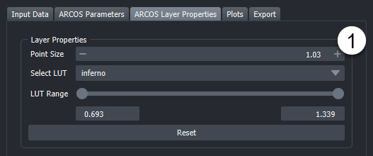
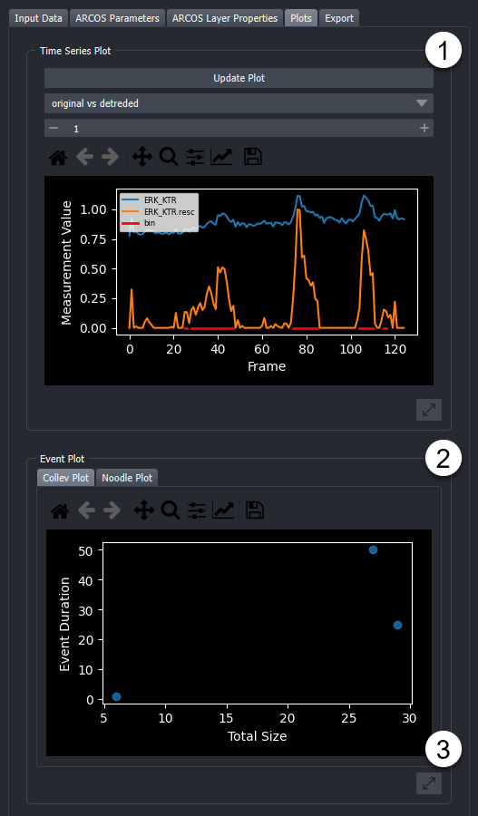
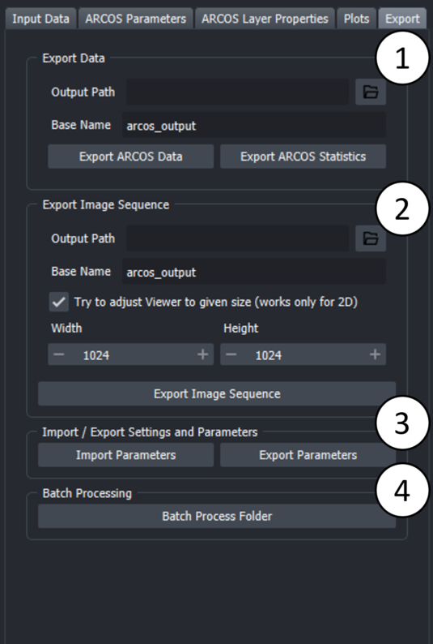

# Usage

The following section shows how to use arcos-gui.

## Open Main Widget, Load Data, and run ARCOS

#### Open Widget
Make sure the arcos-gui and napari are installed.

0. Open napari and dock the ARCOS main widget:

#### Load Data

1. Tabs represent different steps taken during the processing. Select the "Input Data" Tab to load a csv file.

2. Open file browser by clicking on the folder icon and select CSV file with data in long format.
    CSV file can be either comma, semicolon or tab separated. Additionally arcos-gui supports loading csv.gz files. Then press the "Load Data" button.

3. In the popup dialogue, select columns corresponding to the indicated label. "Z-coordinates", "Position" and "Additional Filter" (e.g Well) can be None if this column does not exist.
    Optionally the measurement used for detecting events can be calculated from two differnt columns i.e for Ratios of fluorescent biosensors). Depending on the selection of the operation via radio buttons,
    an additional column can be specified as second measurement. Default is None.

4. Optional: Filter input data. Parameters can be used to select track length, rescale frame interval and rescale measurement.

#### Run ARCOS
Once data is loaded you can select the "ARCOS Parameters" Tab.

1. Toggle if you want to interpolated your measurement column and if you want to clip your measurement values.

2. Change Binarization parameters, see the [Binarization parameters](#binarization) section for in detail explanation. As a first step, try the None detrending method, since it is the simplest and requires the least tuning of input parameters. To validate binarization you can either look at the created layers. One of which "Active Cells" indicates which objects were detected as being on/ active.

3. "Binarize Data" runs only the binarizatoin process. This can be usefull if the collective event detection takes a while. Aswell as to speed up the process of optimizing the binarizatoin step.

4. Change the Collective event detection parameters, see the [ARCOS parameters](#collective-event-detection) for more details or hover over individual parameters to get tooltipps about individual settings.

5. Update ARCOS. Will run the algorithm and generate layers.

## Output Layers

1. Widget
2. Detected collective event with its convex hull.

3. Layers that the plugin adds are:

    - **All Cells**: Centroid of cells with the color code representing the measurement.
    - **Active cells**: Black points represent active cells according to binarization
    - **Cellective Events Cells**: Points marking cells that are part of a collective event, colored by collective event id.
    - **Collective Event**: the convex hull of collective events, colored by collective event id.

## Additional Functionallity

### Layer Properties

1. This widget allows for adjustments to various layer properties related to vizualization of the ARCOS input and output data.

### Plots
Under the widgets "Plots" tab, several types of plots can be found that describe the time-series data and collective events.
Plots can be saved as images by clicking the "Save" button in the respectives plot toolbar. Exporting as svg is the best option in most cases.

1.
These plots help to choose appropriate parameters for ARCOS and track length filtering.
    Plots are chosen through dropdown menus.
    Available plots are:

    - Track length Histogram

        > Plots a Histogramm of object tracklenghts in the source data.

    - Measurement Density plot

        > This plot shows the density distribution of the original measurement value that was selected in the columnpicker. The density is calculated using a kernel density
        estimation algorithm (kde).

    - Measurement Density plot (rescaled)

        > This plot shows a the density distribution of the rescaled measurement value as calculated during the binarizatoin step. The density is calculated using a kernel density
    estimation algorithm (kde).

    - Original vs Rescaled measurement

        > The Original vs Rescaled plot is plotting the rescaled and detrended signal of a random object. To choose another random object, the "Update Plot" button can be pressed.
        In addition by selecting the "All Cells" layer in the viewer and using the selection tool to click on individual points, the corresponding signals are plotted, with an
        indication in red of which part of the time series were detected as being active.

    - X-T and Y-T plot

        > These two plots project the tracks in the filtered data on one axis and have the time on the other. This allows to check the quality of the tracking to a certain extent.

2.
These plots are both interactive and allow users to explore the ARCOS output more in-depth.
The respective plot can be selected from the corresponding tab.
Available plots are:
    - Collev Plot:

        > Interactive Scatterplot of duration vs size of Collective events.
        On hover, shows collective event id, on click takes user to first frame of selected collective event and marks this event with a bounding box.

    - Noodle Plot:

        > Interactive Noodleplot of position coordinate vs time. Individual lines represent individual objects (such as cells). Lines are colored by collective event id.
        On hover, shows collective event id, on click takes user to first frame of selected collective event and marks this event with a bounding box.
        Dropdown allows choice of projection axis.

3.
By clicking on this button the plot is opend as a popup window that can be freely resized. By closing this popup window the plot is readded to the widget.

### Export

In this tab various optoins for exporting output are available.

1.
The data generated by Arcos can be exported as a CSV file. "Export ARCOS Data" will save a csv file containing the input data appended with a column containing trackids for collective event.
"Export ARCOS Statistics" will save a csv file containing some basic collective event statistics such as average duration, staringpoint, endingpoint
"Export Parameters" will save a csv file containg the parameters used for detecting collective events.

2.
The layers generated by arcos can be exported as a sequence of screenshots. Also a "Add Timestamp" button can optionally add a timestamp layer to the output.
The checkbox "Try to adjust Viewer" will try to fit the data in the viewer to the specified size. This is an experimental feature and will likely not work for 3D data and not for either very large, or very small dimensions since the viewer has limits on how small/ how large it can get. These depend on the actual screensize.

## ARCOS parameters

### Measurement
| Parameters               | Description                                                                                                        |
|--------------------------|--------------------------------------------------------------------------------------------------------------------|
| Interpolate Measurements | If the tickbox is checked, missing values are  interpolated across all columns in the input data                       |
| Clip Measurements        | if the tickbox is checked, the measurement will be clipped according to the quantiles provided in clip low and clip high |
| Clip Low                 | appears if clip measurements is checked                                                                            |
| Clip High                | appears if clip measurements is checked                                                                            |

### Binarization

| Parameter                 | Description                                                                                         |
|---------------------------|-----------------------------------------------------------------------------------------------------|
| Bias Method               | Choose de-trending method,  can be runmed, lm or none                                     |
| Smooth K                  | Size of the short-term median smoothing filter.                                                         |
| Bias K                    | Available if Bias Method is set to 'runmed',  size of long term median smoothing filter          |
| polyDeg                   | Available if Bias Method is set to 'lm', sets the degree of the polynomial for regression detrending |
| Bin Peak Threshold        | Threshold for rescaling of the de-trended signal.                                                   |

First, a short-term median filter with size smoothK is applied to remove fast noise from the time series. If the Bias Method is set to "none", smoothing is applied on globally rescaled time series. The subsequent de-trending can be performed with a long-term median filter with the size biasK {biasMet = "runmed"} or by fitting a polynomial of degree polyDeg {biasMet = "lm"}.
After de-trending, if the global difference between min/max is greater than the threshold the signal is rescaled to the (0,1) range. The final signal is binarised using the binThr threshold parameter.

### Collective Event Detection

| Parameter          | Description                                                                                                                                                                                                                                                     |
|--------------------|-----------------------------------------------------------------------------------------------------------------------------------------------------------------------------------------------------------------------------------------------------------------|
| Neighbourhood Size | The maximum distance between two samples for one to be considered as in the neighbourhood of the other. This is not a maximum bound  on the distances of points within a cluster.  Value is also used to connect collective events across multiple frames. |
| Min Clustersize    | Minimum size for a cluster to be identified as a collective |
| nPrev frames       | Number of previous frames to consider when tracking collective_events |

### Filter Collective Events

| Parameter        | Description                                           |
|------------------|-------------------------------------------------------|
| Min Duration     | Minimal duration of collective events to be selected. |
| Total Event Size | Minimal total event size.                             |

### Additional
Add Convex Hull: If checked, the convex hull is calculated for each collective event and drawn in 2d as polygons, in 3d as surfaces. If a large ammount of collective events are detected, adding
polygons / surfaces can take some time.
